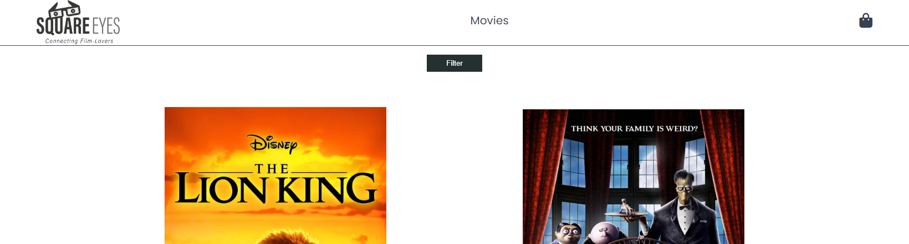

# SquareEyes

Welcome to **SquareEyes**, a dynamic web application designed to showcase movies. This project leverages JavaScript and a school API to provide an interactive platform where users can browse movies, filter them by genre, and manage a shopping cart.



## Features

- **Dynamic Movie Display**: Utilizes JavaScript to dynamically load movies onto the main page from a school API.
- **Genre Filtering**: Allows users to filter movies based on genre, enhancing the browsing experience.
- **Interactive Shopping Cart**: Enables users to add movies to their cart, view the total cost, and modify the cart items as needed.
- **Checkout Process**: Features a simulated checkout process where users can input their details for a mock purchase.
- **Confirmation Screen**: Provides a confirmation screen post-checkout to confirm the transaction and enhance user satisfaction.

## Project Structure

/SquareEyes<br>
|-- /assets<br>
|  -- /images # Images used in the project<br>
|-- /css # CSS files for styling<br>
|-- /js # JavaScript files for functionality<br>
|-- LICENSE # Project License<br>
|-- README.md # Project documentation<br>
|-- checkout.html # Checkout page<br>
|-- index.html # Main page where movies are displayed<br>
|-- movie.html # Individual movie details page<br>
|-- success.html # Confirmation page after checkout<br>


## Technologies Used

- **HTML**: For structuring the web pages.
- **CSS**: For styling all the web components.
- **JavaScript**: Used to interact with the API and manage the shopping cart functionality.

## Setup and Installation

No installation is required to view the live demo. However, if you wish to run the project locally or contribute, you may clone the repository using the following command:

1. Clone the repository:
   ```bash
   git clone https://github.com/KjetilHHauger/SquareEyes.git
2. cd SquareEyes
3. Open index.html in your browser to view the project.

## How to Use
- **Browse Movies**: Visit the main page to see the latest movies loaded from the API.
- **Filter Movies**: Use the genre filter on the main page to narrow down your movie choices.
- **Add to Cart and** Checkout: Click on any movie to add it to your cart. Go to your cart, adjust quantities or remove items, and proceed to checkout by filling in dummy fields.

## Contributing
Contributions to improve the project are always welcome. Please feel free to fork the repository, make changes, and submit pull requests. Ensure you provide a detailed description of your changes and improvements.

## Contact
[My LinkedIn](https://www.linkedin.com/in/kjetil-harneshaug-hauger-00851084/)

## License
This project is licensed under the MIT License - see the LICENSE file for details.

Thank you for visiting the SquareEyes repository. Explore the codebase and enjoy using the application!
